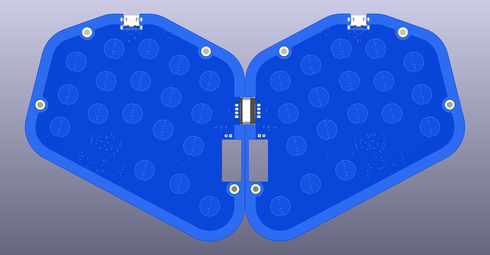
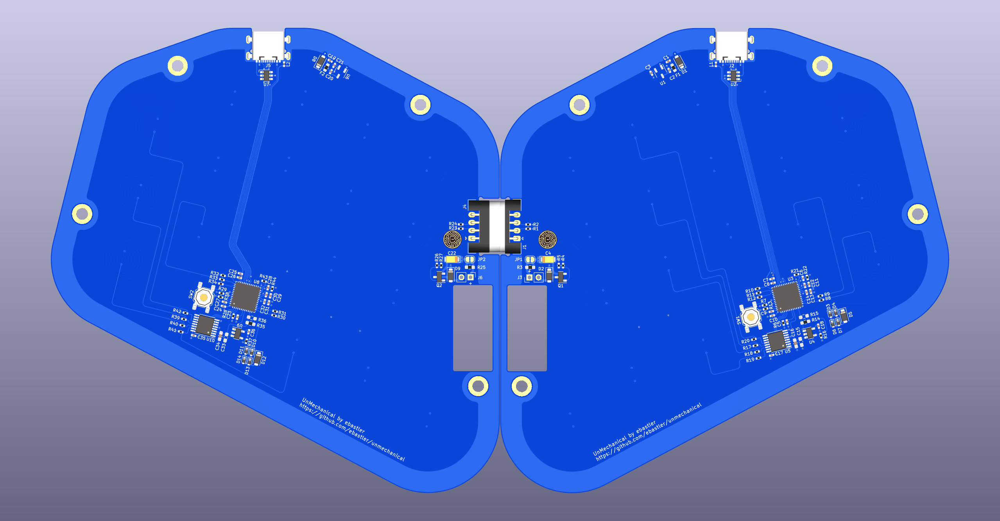
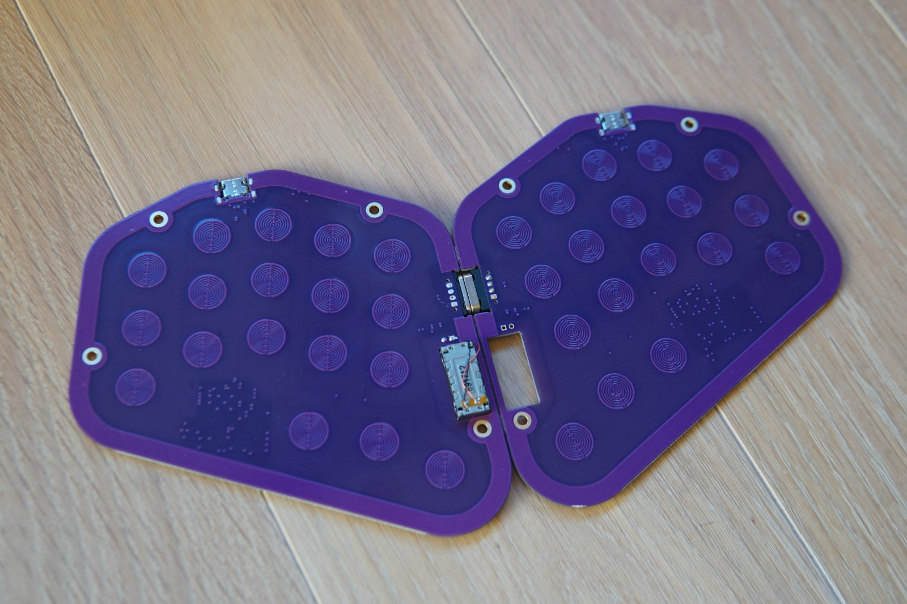
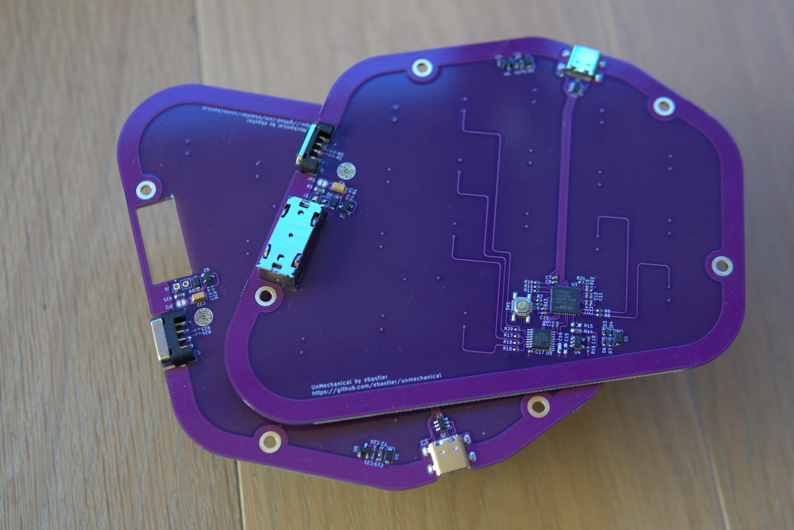

# UnMechanical
 Unmechanical is an attempt to create a capacitive touch keyboard, replacing switches with touchpads.

 The operating principle is pretty much unchanged from the EC boards by [cipulot](https://github.com/Cipulot). Basically, the columns are strobed by the MCU, and the capacitive touchpad forms a capacitive voltage divider together with a 220pF resistor on the PCB. The voltage over the capacitor is measured to determine the capacity of the touchpad, which strongly changes if the pad is touched.

 In order to be able to scan multiple rows, the board uses an analog mux chip that switches from row to row. The input signal is amplified by an OPAMP, since QMK does not offer support for the STM32G431 built-in OPAMPs yet.

## Sweepish
So far, this repository contains a single board, "Sweepish", which consists of a Sweep 3x5 alpha cluster, and a modified 3 key thumb cluster. 

### Features:
* 36 capacitive touch-keys (Layout similar to Sweep)
* Magnetic split connect, allowing for unibody-use
* USB-C PD peripheral of the STM32G431 chip connected to USB-C port
* Circuitry and hole in PCB to mount a Switch Joycon haptic actuator and use it for typing feedback

The board is designed to be used as a unibody, held together by HytePro M411P magnetic pogo connectors, but can also be made into a "proper" split board by using a magnetic cable assembly instead.

Firmware support, as well as some optimizations to make the board nicer to use, are still being worked on (so far it can only work as a single half, split EC keyscan does not work yet). The repo is only published as a proof-of-concept - more or less what the entire board design was for, in the first place. 

This keyboard also uses the USB-C PD peripheral of the STM32G431 since I wanted to make a test-board to experiment using it.

### Pictures

A short video showing the board in action can be found on my youtube channel: https://youtu.be/7uHqJic0PQ8

## Thanks
* [cipulot](https://github.com/Cipulot) for his EC boards, EC QMK keyscan firmwares and help in developing this PCB
* [PCBWay](https://www.pcbway.com/) for the gorgeous sponsored PCBs - couldn't have done it without you!